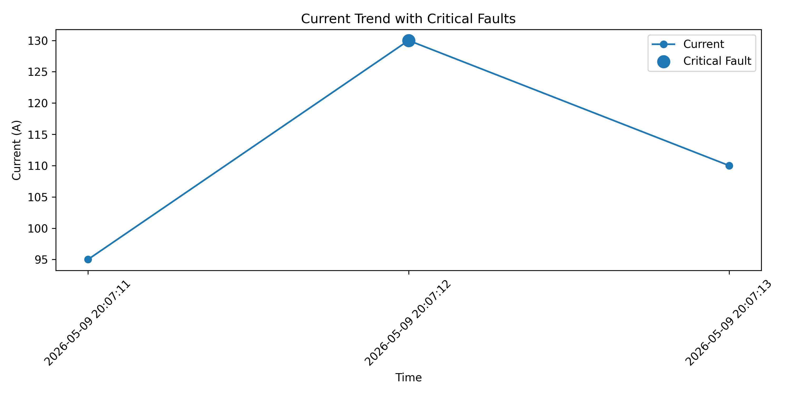
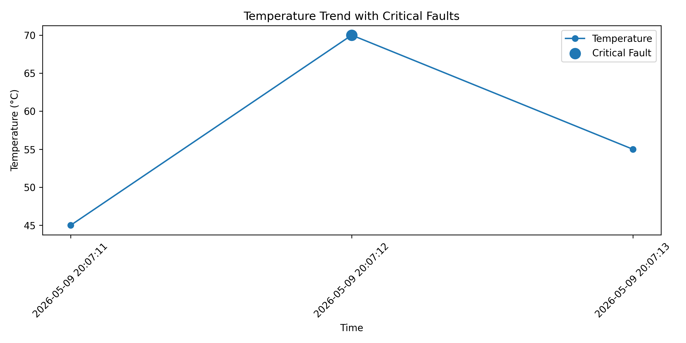
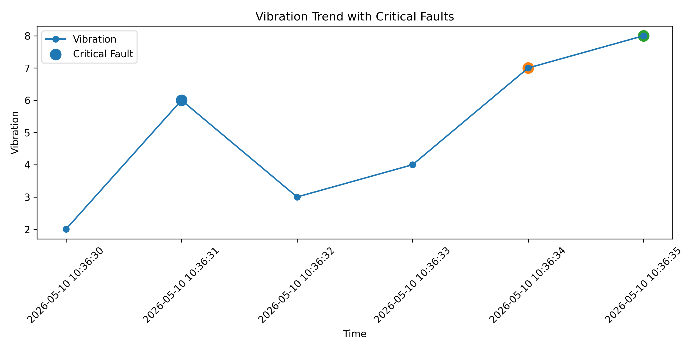

# Smart Turbine Fault Analyzer

Python-based industrial fault monitoring and turbine analysis system.

## Features
- Sensor feasibility and warning detection
- Real-time monitoring simulation
- Intelligent fault detection
- Critical shutdown logic
- Maintenance reporting
- CSV fault log export
- Current, temperature, and vibration visualization
- Critical fault highlighting

## Technologies Used

- Python
- matplotlib
- csv
- time
  
## How to Run

1. Download or clone the repository.
2. Open the project folder in VS Code or another Python editor.
3. Run the Python file:

```bash
python smart_turbine_fault_analyzer.py
```
## Fault Types Detected

- Overcurrent
- Overheating
- High vibration
- Emergency shutdown
- Sensor failure

---

## Current Trend Graph



--

## Temperature Trend Graph



---

## Vibration Trend Graph



